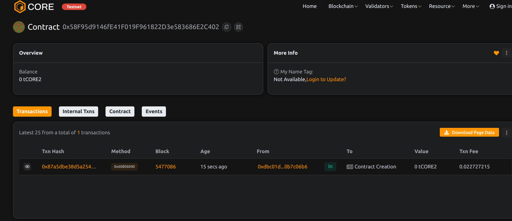

# RentFlow – Smart Contract for Rental Agreements and    Payment Flows

## 📄 Project   Description

RentFlow is a decentralized rental agreement and payment system powered by smar t contracts. It allows landlords and tenants to engage in trustless rental contracts with automatic payment tracking and enforcement.    

## 🎯 Project Vision

To eliminate middlemen and provide a transparent, tamper-proof rental experience whe   re lease terms and payments are enforced by code rather than trust.
       
## ✨ Key Featur

- 🏡 Create and manage digital rental agreements
- 💰 Automated rent collection and transfer to landlord
- ⏱️ Due date enforcement and tracking
- ❌ Contract termination by authorized parties
- 📊 Transparent and auditable agreement records

## 🔮 Future Scope

- Deposit holding and refund management
- Integration with identity/KYC verification
- Escrow system for disputes
- Token-based rent payments (ERC-20 stablecoins)

## 📜 Contract Details
0x58F95d9146fE41F019F961822D3e583686E2C402

